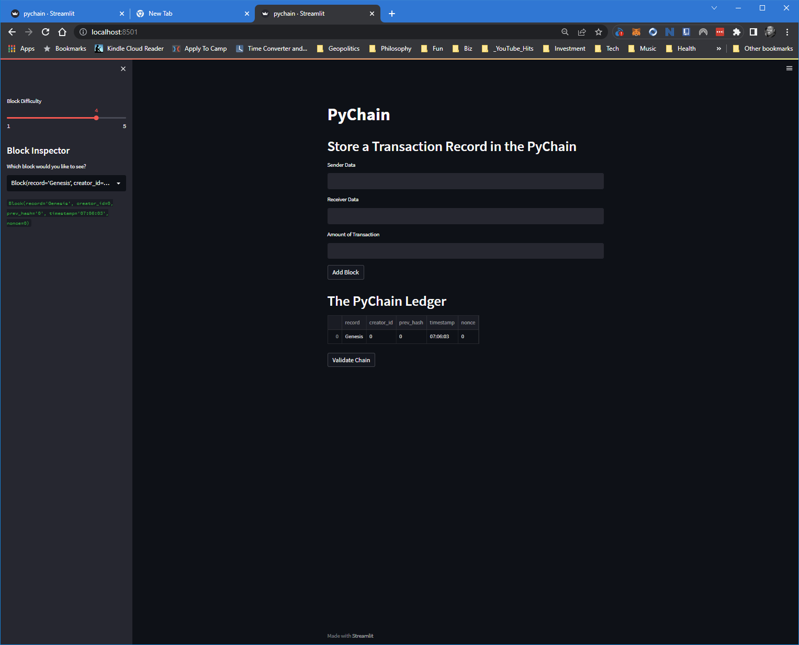
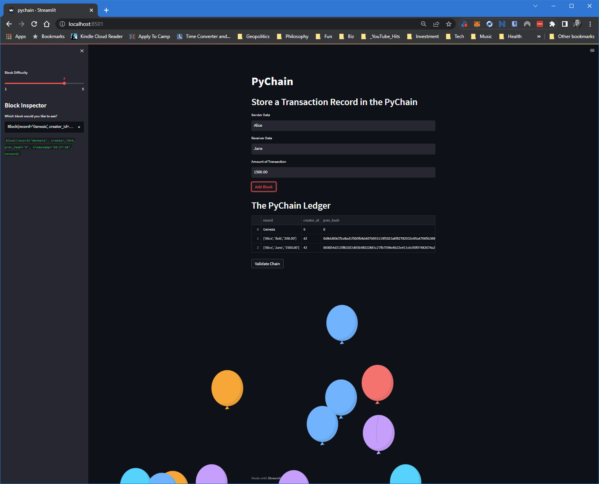
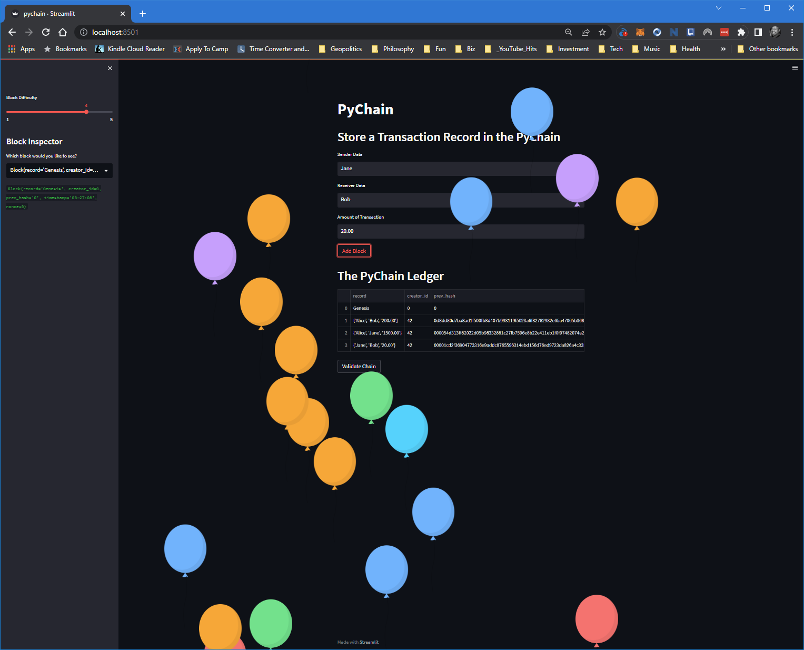
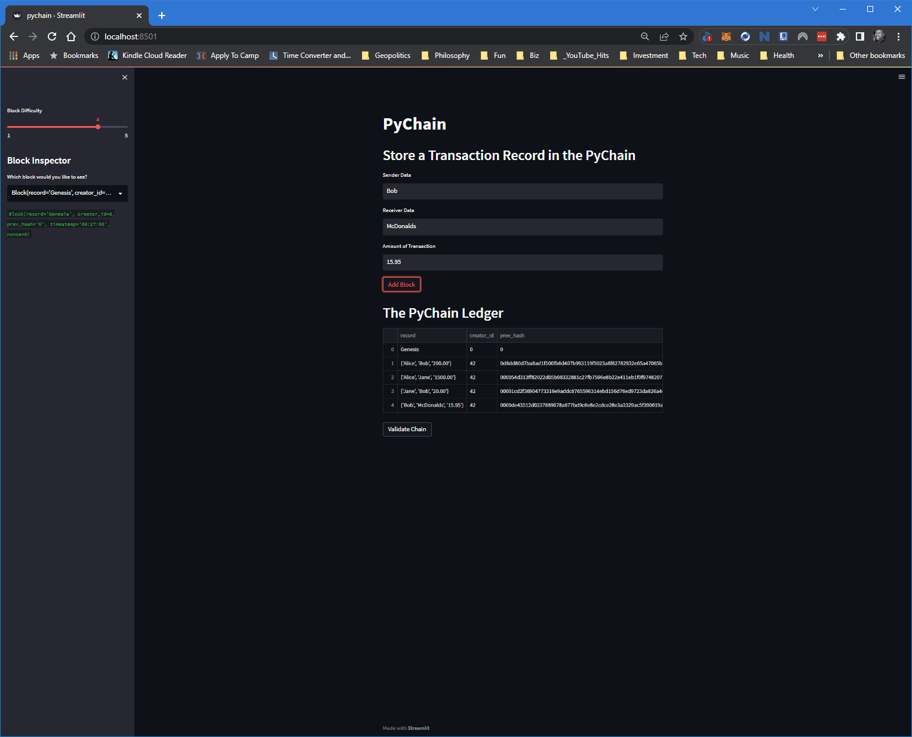
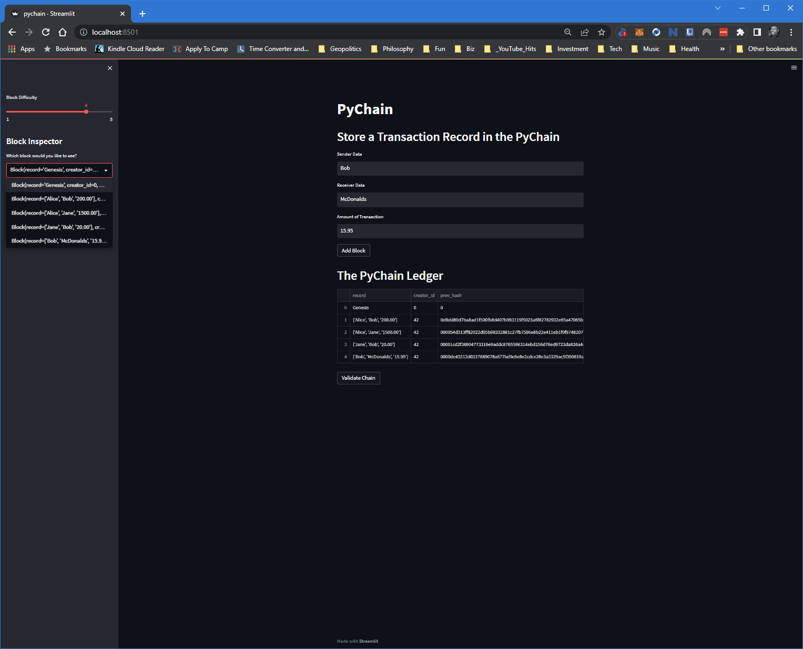
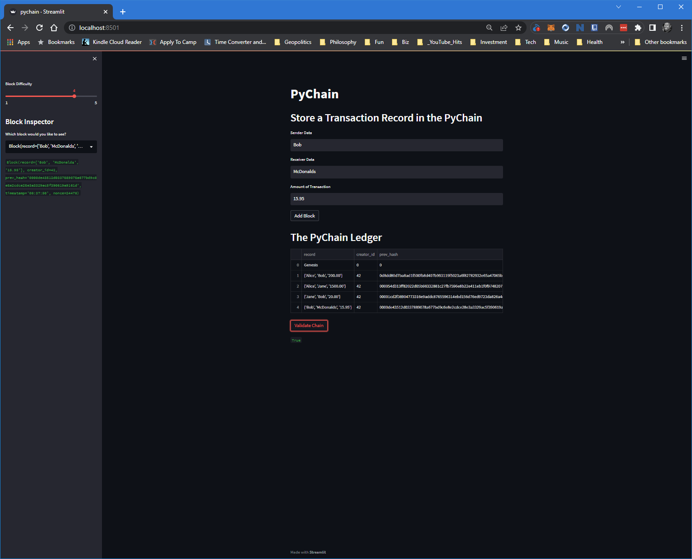

# PyChain Ledger

As a fintech engineer who’s working at one of the five largest banks in the world. I was recently promoted to act as the lead developer on their decentralized finance team. My task was to build a blockchain-based ledger system, complete with a user-friendly web interface. This ledger should allow partner banks to conduct financial transactions (that is, to transfer money between senders and receivers) and to verify the integrity of the data in the ledger.

---

# Screenshot of final product
## Initilising the blockchain

## Populating the blockchain
### 2nd, 3rd, and fourth transactions and Sidebar Dropdown verification

---

---

---

---

## Chain Validation

---

© 2021 Trilogy Education Services, a 2U, Inc. brand. All Rights Reserved.
